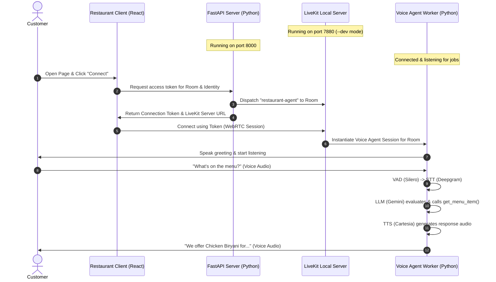

# Monal Restaurant Voice AI Assistant

Welcome to the **Monal Restaurant Voice AI Assistant** project. This repository contains a fully local voice assistant built using LiveKit, FastAPI, and React. Customers can interact with this assistant via voice to query the menu, ask about restaurant policies (dress code, parking, hours), and make reservations.

---

## 🏗️ System Architecture

The project consists of four primary components interacting with each other in real-time:



### Component Details
1. **[LiveKit Local Server](file:///d:/dummy/livekit-server-v1.13.4)**:
   A self-hosted LiveKit instance running locally using [livekit-server.exe](file:///d:/dummy/livekit-server-v1.13.4/livekit-server.exe). It manages real-time WebRTC audio rooms and handles audio processing coordination.
2. **[FastAPI Server](file:///d:/dummy/agent-starter-python)**:
   A Python FastAPI application initiated from [main.py](file:///d:/dummy/agent-starter-python/main.py) (running on port `8000`). It generates access tokens using standard dev credentials and dispatches the LiveKit agent to the room via [livekit_service.py](file:///d:/dummy/agent-starter-python/src/services/livekit_service.py).
3. **[LiveKit Voice Agent Worker](file:///d:/dummy/agent-starter-python)**:
   A Python agent worker implemented in [agent.py](file:///d:/dummy/agent-starter-python/src/agent.py). It registers with the local LiveKit server, listens for room dispatch requests, and handles the AI conversation using:
   - **VAD**: [Silero VAD](https://github.com/snakers4/silero-vad) for voice activity detection.
   - **STT**: [Deepgram](https://deepgram.com/) (`nova-3` model) for speech-to-text.
   - **LLM**: [Google Gemini](https://ai.google.dev/) (`gemini-2.5-flash`) for natural language reasoning.
   - **TTS**: [Cartesia](https://cartesia.ai/) (`sonic-3`) for high-fidelity text-to-speech.
   - **Custom Tools**: Checks current time, searches the [knowledge_base.md](file:///d:/dummy/agent-starter-python/src/data/knowledge_base.md) for policies, and retrieves items from [menu.json](file:///d:/dummy/agent-starter-python/src/data/menu.json).
4. **[Restaurant Frontend Client](file:///d:/dummy/restaurant-client)**:
   A React application built with Vite ([package.json](file:///d:/dummy/restaurant-client/package.json)). It uses `@livekit/components-react` to manage the audio session and microphone toggles, presenting a clean UI to the end user.

---

## 🛠️ Prerequisites

Ensure you have the following installed on your machine:
- **Node.js** (v18+ recommended)
- **Python** (v3.10+ recommended)
- **uv** (Python package installer and environment manager)
- **Active API Keys**: Deepgram, Cartesia, and Google Gemini. (These are already configured in [agent-starter-python/.env](file:///d:/dummy/agent-starter-python/.env)).

---

## 🚀 Running the App (Step-by-Step)

Follow these steps exactly, from start to finish:

### Step 1: Start the Local LiveKit Server
The project includes a pre-packaged Windows binary for LiveKit Server.
1. Open a terminal and navigate to the server folder:
   ```powershell
   cd d:\dummy\livekit-server-v1.13.4
   ```
2. Start the server in development mode:
   ```powershell
   .\livekit-server.exe --dev
   ```
   *Note: This starts the server on `ws://localhost:7880` with the default development credentials (API Key: `devkey`, API Secret: `secret`). Keep this terminal open.*

### Step 2: Set Up and Run the Python Backend & Agent
1. Open a new terminal and navigate to the agent directory:
   ```powershell
   cd d:\dummy\agent-starter-python
   ```
2. Install the required Python dependencies:
   ```powershell
   uv sync
   ```
3. Start the FastAPI backend server (which generates tokens for the client):
   ```powershell
   uv run python main.py
   ```
   *Note: This starts the token server at `http://127.0.0.1:8000`. Keep this terminal open.*
4. Open another terminal in the same directory (`d:\dummy\agent-starter-python`) and start the LiveKit Agent worker:
   ```powershell
   uv run python src/agent.py dev
   ```
   *Note: The agent worker will register itself with the local LiveKit server. Keep this terminal open.*

### Step 3: Set Up and Run the React Frontend Client
1. Open a new terminal and navigate to the frontend directory:
   ```powershell
   cd d:\dummy\restaurant-client
   ```
2. Install node dependencies:
   ```powershell
   npm install
   ```
3. Start the frontend client in dev mode:
   ```powershell
   npm run dev
   ```
4. Open the URL printed in the terminal (usually `http://localhost:5173`) in your web browser.

---

## 🎙️ Interacting with the Assistant

1. In the browser, enter any name for **Identity** (e.g., `guest-1`) and a room name (e.g., `monal-room`).
2. Click **Connect**.
3. Allow the browser access to your microphone when prompted.
4. The system will dispatch the agent, which will join the room and say a warm greeting.
5. You can now talk to the assistant! Try asking questions such as:
   - *"What are your opening hours?"* (Agent uses `search_knowledge_base`)
   - *"Is parking free?"* (Agent uses `search_knowledge_base`)
   - *"What's the price of Chicken Biryani?"* (Agent uses `get_menu_item`)
   - *"Do you have Seekh Kebab?"* (Agent uses `get_menu_item`)
   - *"What is the dress code?"* (Agent uses `search_knowledge_base`)

---

## 📂 Codebase Navigation Links

- **Agent Configuration & Service Files**:
  - Main Agent Entrypoint: [agent.py](file:///d:/dummy/agent-starter-python/src/agent.py)
  - FastAPI App Definition: [app.py](file:///d:/dummy/agent-starter-python/app.py)
  - FastAPI Server Runner: [main.py](file:///d:/dummy/agent-starter-python/main.py)
  - System Prompts & Instructions: [system_prompt.py](file:///d:/dummy/agent-starter-python/src/system_prompt.py)
  - Token Dispatcher Service: [livekit_service.py](file:///d:/dummy/agent-starter-python/src/services/livekit_service.py)
  - Restaurant Menu Data: [menu.json](file:///d:/dummy/agent-starter-python/src/data/menu.json)
  - Knowledge Base: [knowledge_base.md](file:///d:/dummy/agent-starter-python/src/data/knowledge_base.md)
- **Frontend Code**:
  - App Root React Component: [App.jsx](file:///d:/dummy/restaurant-client/src/App.jsx)
  - Connect Form Component: [ConnectForm.jsx](file:///d:/dummy/restaurant-client/src/components/ConnectForm.jsx)
  - LiveKit Audio Room Wrapper: [AgentRoom.jsx](file:///d:/dummy/restaurant-client/src/components/AgentRoom.jsx)
