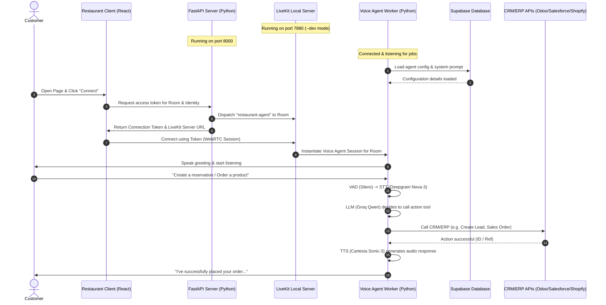

# Monal Restaurant Voice AI Assistant

Welcome to the **Monal Restaurant Voice AI Assistant** project. This repository contains a fully local voice assistant built using LiveKit, FastAPI, and React. Customers can interact with this assistant via voice to query the menu, ask about restaurant policies (dress code, parking, hours), and make reservations.

---

## 🐧 Running in WSL
If you're using WSL, run the app from the mounted workspace path and start the LiveKit server through PowerShell because the bundled server binary is a Windows executable.

```bash
cd /mnt/d/Livekit-Local-Setup

# Start LiveKit from WSL using PowerShell
powershell.exe -Command "Set-Location 'D:\\Livekit-Local-Setup\\livekit-server-v1.13.4'; .\\livekit-server.exe --dev"
```

Open additional WSL terminals for the other services:

```bash
cd /mnt/d/Livekit-Local-Setup/agent-starter-python
uv sync
uv run python main.py
```

```bash
cd /mnt/d/Livekit-Local-Setup/agent-starter-python
uv run python src/agent.py dev
```

```bash
cd /mnt/d/Livekit-Local-Setup/restaurant-client
npm install
npm run dev
```

Then open http://localhost:5173 in your browser.

> If the LiveKit process does not start from WSL, launch it from a Windows PowerShell terminal instead and leave it running while you use the app.

---

## ✨ Features & Integrations

The Voice AI Assistant has been upgraded with the following integrations and capabilities:

1. **Dynamic Prompt & Configuration (Supabase)**:
   - Configuration is loaded dynamically using a Supabase database helper. System prompts and knowledge bases are loaded dynamically based on the agent's name (e.g. `"Achha Foods"`).
2. **Advanced Language Model (Groq / Qwen)**:
   - Conversational reasoning is powered by Groq's high-speed API utilizing `qwen/qwen3.6-27b`.
3. **Multilingual Speech-to-Text (Deepgram)**:
   - Configured with Deepgram's latest `nova-3` multilingual engine for low-latency voice transcription.
4. **CRM Lead Generation (Salesforce)**:
   - Auto-creates Leads in Salesforce when a reservation is successfully confirmed, saving the guest details, timing, preferences, and special requests via Client Credentials OAuth 2.0 flow.
5. **ERP & Order Management (Odoo)**:
   - Automatically logs customer contacts, creates CRM Leads, queries product prices in real-time, generates sales orders, confirms sales orders, handles invoicing, and automatically emails invoice documents to the customer.
6. **E-Commerce Integration (Shopify)**:
   - Registers new shopify customer records, fetches current product price points, and registers Shopify sales orders.

---

## 🏗️ System Architecture

The project consists of four primary components interacting with each other in real-time:



### Component Details
1. **[LiveKit Local Server](file:///d:/Livekit-Local-Setup/livekit-server-v1.13.4)**:
   A self-hosted LiveKit instance running locally using [livekit-server.exe](file:///d:/Livekit-Local-Setup/livekit-server-v1.13.4/livekit-server.exe). It manages real-time WebRTC audio rooms.
2. **[FastAPI Server](file:///d:/Livekit-Local-Setup/agent-starter-python)**:
   A Python FastAPI application initiated from [main.py](file:///d:/Livekit-Local-Setup/agent-starter-python/main.py) (running on port `8000`). It generates access tokens using standard dev credentials and dispatches the LiveKit agent to the room via [livekit_service.py](file:///d:/Livekit-Local-Setup/agent-starter-python/src/services/livekit_service.py).
3. **[LiveKit Voice Agent Worker](file:///d:/Livekit-Local-Setup/agent-starter-python)**:
   A Python agent worker implemented in [agent.py](file:///d:/Livekit-Local-Setup/agent-starter-python/src/agent.py). It registers with the local LiveKit server, listens for room dispatch requests, and handles the AI conversation using:
   - **VAD**: [Silero VAD](https://github.com/snakers4/silero-vad) for voice activity detection.
   - **STT**: [Deepgram](https://deepgram.com/) (`nova-3` model) for speech-to-text.
   - **LLM**: [Groq](https://groq.com) (`qwen/qwen3.6-27b`) for reasoning.
   - **TTS**: [Cartesia](https://cartesia.ai/) (`sonic-3`) for voice synthesis.
   - **Custom Tools**: Supabase config loader, Salesforce leads integration, Odoo leads/sales integration, Shopify order manager, knowledge base search, and menu tools.
4. **[Restaurant Frontend Client](file:///d:/Livekit-Local-Setup/restaurant-client)**:
   A React application built with Vite ([package.json](file:///d:/Livekit-Local-Setup/restaurant-client/package.json)). It uses `@livekit/components-react` to manage the audio session and microphone toggles, presenting a clean UI to the end user.

---

## 🛠️ Prerequisites

Ensure you have the following installed on your machine:
- **Node.js** (v18+ recommended)
- **Python** (v3.10+ recommended)
- **uv** (Python package installer and environment manager)
- **Active API Keys / Settings**:
  - LiveKit, Deepgram, Cartesia, and Groq keys.
  - Supabase credentials (`SUPABASE_URL`, `SUPABASE_SERVICE_ROLE_KEY`).
  - (Optional) Salesforce OAuth Credentials (`SF_CLIENT_ID`, `SF_CLIENT_SECRET`, `SF_INSTANCE_URL`).
  - (Optional) Odoo credentials (`ODOO_URL`, `ODOO_DB`, `ODOO_USERNAME`, `ODOO_API_KEY`).
  - (Optional) Shopify tokens.

---

## 🚀 Running the App (Step-by-Step)

### Step 1: Start the Local LiveKit Server
The project includes a pre-packaged Windows binary for LiveKit Server.
1. Open a terminal and navigate to the server folder:
   ```powershell
   cd d:\Livekit-Local-Setup\livekit-server-v1.13.4
   ```
2. Start the server in development mode:
   ```powershell
   .\livekit-server.exe --dev
   ```
   *Note: This starts the server on `ws://localhost:7880` with the default development credentials (API Key: `devkey`, API Secret: `secret`). Keep this terminal open.*

### Step 2: Set Up and Run the Python Backend & Agent
1. Open a new terminal and navigate to the agent directory:
   ```powershell
   cd d:\Livekit-Local-Setup\agent-starter-python
   ```
2. Install the required Python dependencies:
   ```powershell
   uv sync
   ```
3. Configure your `.env` file with necessary keys (copy `.env.example` as a starter and add keys for Supabase, Groq, Salesforce, Odoo, Shopify, etc.).
4. Start the FastAPI backend server (which generates tokens for the client):
   ```powershell
   uv run python main.py
   ```
   *Note: This starts the token server at `http://127.0.0.1:8000`. Keep this terminal open.*
5. Open another terminal in the same directory (`d:\Livekit-Local-Setup\agent-starter-python`) and start the LiveKit Agent worker:
   ```powershell
   uv run python src/agent.py dev
   ```
   *Note: The agent worker will register itself with the local LiveKit server. Keep this terminal open.*

### Step 3: Set Up and Run the React Frontend Client
1. Open a new terminal and navigate to the frontend directory:
   ```powershell
   cd d:\Livekit-Local-Setup\restaurant-client
   ```
2. Install node dependencies:
   ```powershell
   npm install
   ```
3. Start the frontend client in dev mode:
   ```powershell
   npm run dev
   ```
4. Open the URL printed in the terminal (usually `http://localhost:5173`) in your web browser.

---

## 🎙️ Interacting with the Assistant

1. In the browser, enter any name for **Identity** (e.g., `guest-1`) and a room name (e.g., `monal-room`).
2. Click **Connect**.
3. Allow the browser access to your microphone when prompted.
4. The system will dispatch the agent, which will join the room and say a warm greeting.
5. You can now talk to the assistant! Try asking questions such as:
   - *"What are your opening hours?"* (Agent uses `search_knowledge_base`)
   - *"Is parking free?"* (Agent uses `search_knowledge_base`)
   - *"What's the price of Chicken Biryani?"* (Agent uses `get_menu_item`)
   - *"Do you have Seekh Kebab?"* (Agent uses `get_menu_item`)
   - *"What is the dress code?"* (Agent uses `search_knowledge_base`)
   - Or perform orders & leads creation using Odoo, Salesforce, or Shopify!

---

## 📂 Codebase Navigation Links

- **Agent Configuration & Service Files**:
  - Main Agent Entrypoint: [agent.py](file:///d:/Livekit-Local-Setup/agent-starter-python/src/agent.py)
  - FastAPI App Definition: [app.py](file:///d:/Livekit-Local-Setup/agent-starter-python/app.py)
  - FastAPI Server Runner: [main.py](file:///d:/Livekit-Local-Setup/agent-starter-python/main.py)
  - System Prompts & Instructions: [system_prompt.py](file:///d:/Livekit-Local-Setup/agent-starter-python/src/system_prompt.py)
  - Supabase Config Loader: [supabase_loader.py](file:///d:/Livekit-Local-Setup/agent-starter-python/src/supabase_loader.py)
  - Token Dispatcher Service: [livekit_service.py](file:///d:/Livekit-Local-Setup/agent-starter-python/src/services/livekit_service.py)
  - Restaurant Menu Data: [menu.json](file:///d:/Livekit-Local-Setup/agent-starter-python/src/data/menu.json)
  - Knowledge Base: [knowledge_base.md](file:///d:/Livekit-Local-Setup/agent-starter-python/src/data/knowledge_base.md)
- **Agent Action Tools**:
  - Salesforce Lead creator: [salesforce_lead.py](file:///d:/Livekit-Local-Setup/agent-starter-python/src/tools/salesforce_lead.py)
  - Odoo CRM/ERP tools: [odoo_lead.py](file:///d:/Livekit-Local-Setup/agent-starter-python/src/tools/odoo_lead.py)
  - Shopify integration tools: [shopify.py](file:///d:/Livekit-Local-Setup/agent-starter-python/src/tools/shopify.py) and [shopify_customer.py](file:///d:/Livekit-Local-Setup/agent-starter-python/src/tools/shopify_customer.py)
- **Frontend Code**:
  - App Root React Component: [App.jsx](file:///d:/Livekit-Local-Setup/restaurant-client/src/App.jsx)
  - Connect Form Component: [ConnectForm.jsx](file:///d:/Livekit-Local-Setup/restaurant-client/src/components/ConnectForm.jsx)
  - LiveKit Audio Room Wrapper: [AgentRoom.jsx](file:///d:/Livekit-Local-Setup/restaurant-client/src/components/AgentRoom.jsx)
